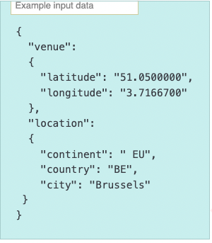
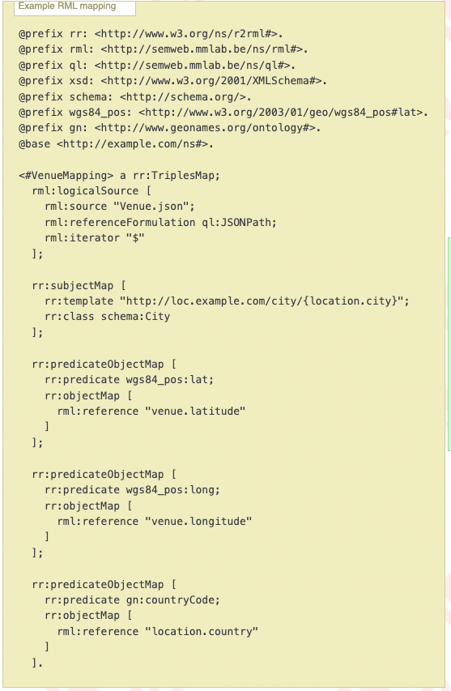
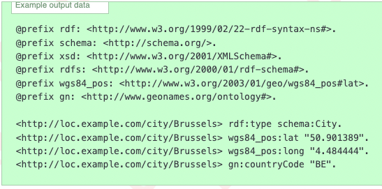
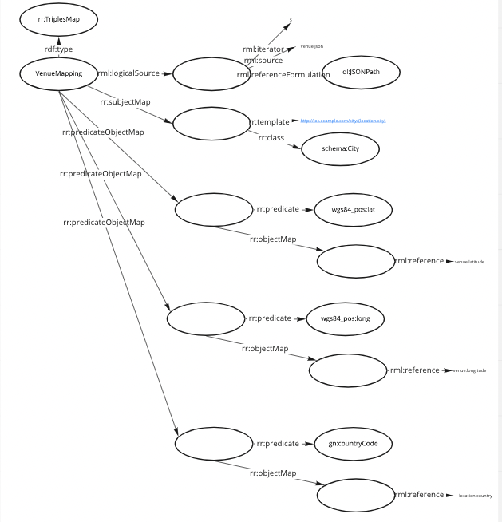
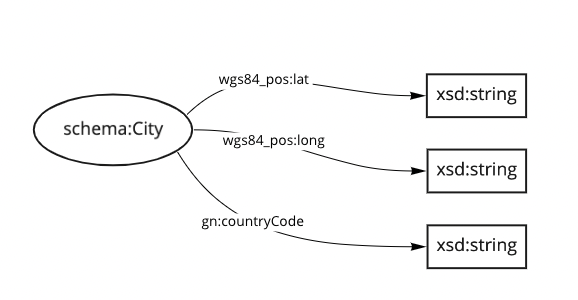
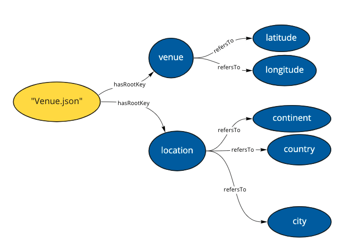
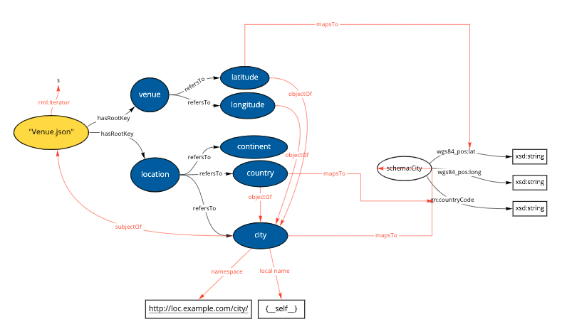

# Generating a RML file by Describing the data source semantically
This is a prototype for generating a RML file by describing the source data and how it maps to a schema.

## Introduction

Normally, in order to transform the contentents of a JSON file into Resource Description Framework (RDF) form we use a manually created Resource Mapping Language (RML) file. 

### Example source JSON, RML, and target RDF
The below examples are taken from [https://rml.io/specs/rml/#example-JSON](https://rml.io/specs/rml/#example-JSON).

#### Source JSON

#### Manually Written RML 

#### Generated Output RDF

The above files are the basis of this prototype and demonstrate how a JSON file is transformed into the output RDF using the instructions laid out in the RML file.

### Drawbacks of this approach

The RML file is long and hard to intuitively understand. Have a look at how it looks like visually.

The drawbacks of this apporach are that 
1. a RML does not semantically describe the data source,
2. does not accommodate adding contextual information to the the data source,
3. is hard to understand intuitively when visualised, and
4. is long and when done manually can result in many mistakes.

In order to improve on these drawback, I am suggesting to generate the RML file by:
1. describing the data source semantically and in an intuitive way to understand it,
2. mapping it to the target schema via easy-to-understand connections.

## Generating the RML

The output RDF file is generated based on a RDF schema for the output, which can be assumed to already exist, when attempting to transform the source JSON file.

What needs to be manually created is the RDF description of the data source. In a later version of this prototype, I hope to also demonstrate how this RDF description can be generated froma  JSON file.

Then a mapping between the data source and the schema needs to be created holding all the information that would typically include in the RML file, such as:
- subject information
- predicate object information for the subject,
- how they map to classes and properties,
- IRI pattern information,
- and iterator.

Below is demonstrated how this mapping looks like in this prototype.

I find the above image much easier to understand than the RML file.

With only these two things, the source description and the mapping, we can now generate the RML file. Please look into `prototype/generateRML.ipynb` for a Python3 Notebook to run the prototype.

